## 소개

 

정다혜(Dahye Jeong)
=========================

경력 5년차, Android, iOS, react-native 기술을 경험하였고 **iOS 앱 개발**을 하고 있습니다. 
계획을 세우는 것을 좋아하고, 절차에 맞게 이행하여 체크리스트에 완료 체크를 하는 것이 가장 즐겁습니다. 
**논리적인 코드**를 작성하고, 컨퍼런스에서 세션을 진행하며 **최신 개발 트렌드**를 읽어가며 
**iOS 앱 개발**에서 **문제 해결 능력이 뛰어난** **경험 많은 개발자**가 되는 것이 목표입니다. 

* Email: [90dhjeong@gmail.com](mailto://90dhjeong@gmail.com)
* Github: [github.com/90dhjeong](https://github.com/90dhjeong)

 

## 목차
* [학력](#학력)
* [경력](#경력)
* [기술](#기술)
* [활동](#활동)
* [프로젝트](#프로젝트)

 

## 학력
*  동덕여자대학교 컴퓨터학과 (2012 ~ 2016)

 

## 경력

[**JESTINA**](https://www.jestina.co.kr/)
> 제이에스티나의 IT팀에서 모바일 앱 개발/관리를 담당하였습니다.
> 퇴사 후 모바일 앱 관련 자문 및 유지보수 외주를 진행중입니다.

* 기간: 2019.04 ~ 2020.08    
* 직급: 대리
* 기술: Android, Swift, Bitbucket

[**Recordfarm**](https://ko.wikipedia.org/wiki/%EB%A0%88%EC%BD%94%EB%93%9C%ED%8C%9C)
> 사운드클라운드와 유사한 형태의 국내 인디 음악 플랫폼 Recordfarm에서 iOS 개발을 담당하였습니다.
> 이후 업종전환으로 SI/SM을 담당하였습니다.

* 기간: 2016.8 ~ 2018.10
* 직급: Software Engineer
* 기술: Objective-c, Swift, Github, Trello, SourceTree, Slack, React-native

[**nemodigm**](http://www.nemodigm.com/home/index.php?pid=kr)
> 개인의 취향을 기반으로 Youtube 음악을 재생해주는 Android 앱 개발을 담당하였습니다.

* 기간: 2015.02 ~ 2016.02
* 직급: Assistant
* 기술: Android

 

## 기술

### Mobile
- Swift
- Android java
- MVC, MVP, MVVM Pattern

### Process
- 커뮤니케이션 - Slack
- 이슈관리 - Trello
- 버전관리 - Git(Bitbucket/SourceTree)

 

## 활동

[**덕성여자대학교 스마트창작터(중소기업청 정부지원사업)**](https://m.blog.naver.com/PostView.nhn?blogId=dswuniv_blog&logNo=220802103586&proxyReferer=https:%2F%2Fwww.google.com%2F)
> 중소기업청주관 정부지원사업 덕성여자대학교 스마트창작터에서 창업지원팀으로 선발되어 창업팀의 개발팀장을 역임하였습니다.
> 마이포켓클로젯이라는 옷장관리 어플리케이션을 기반으로 창업을 진행하였습니다. 

* 기간 : 2015.04~2015.11

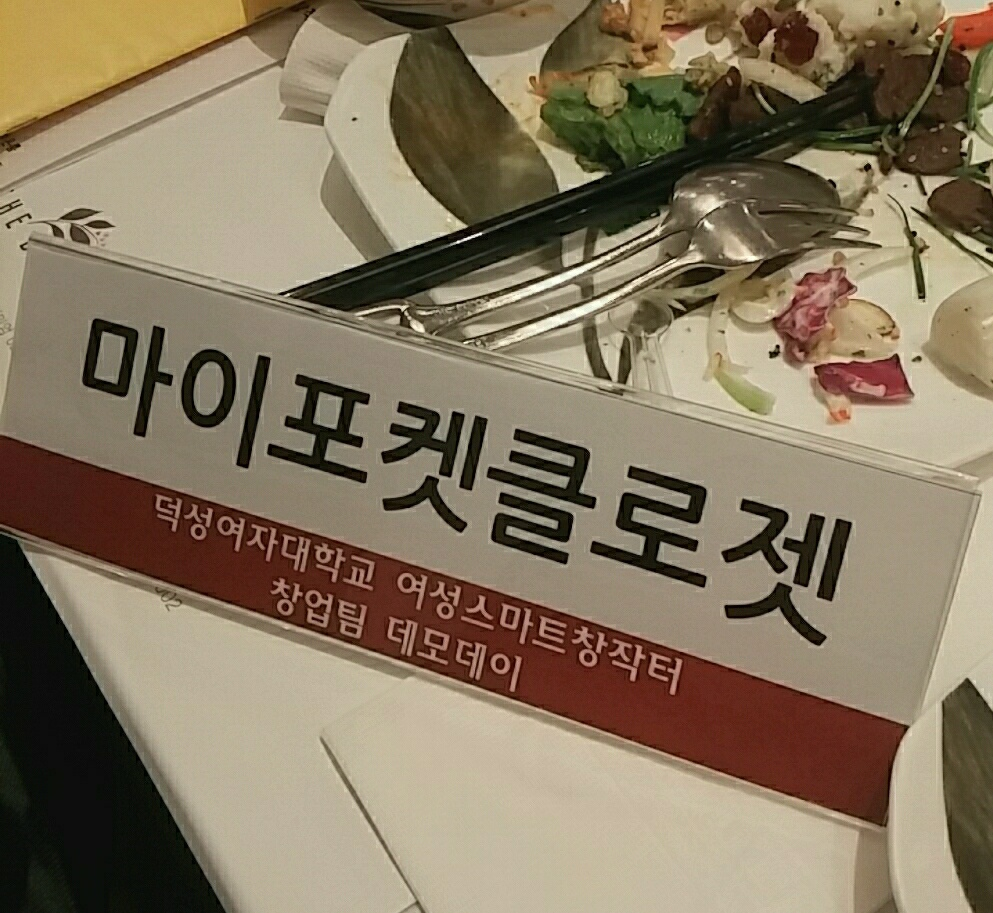  

 

## 프로젝트

**Jestina**

 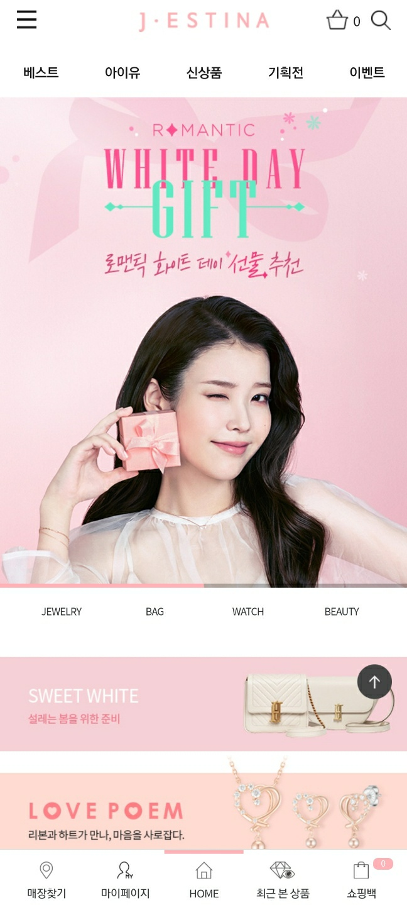 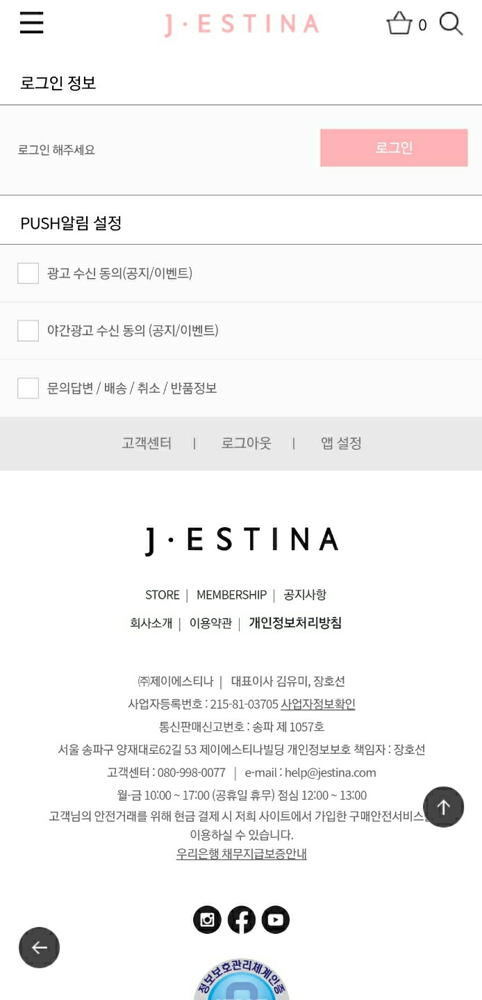 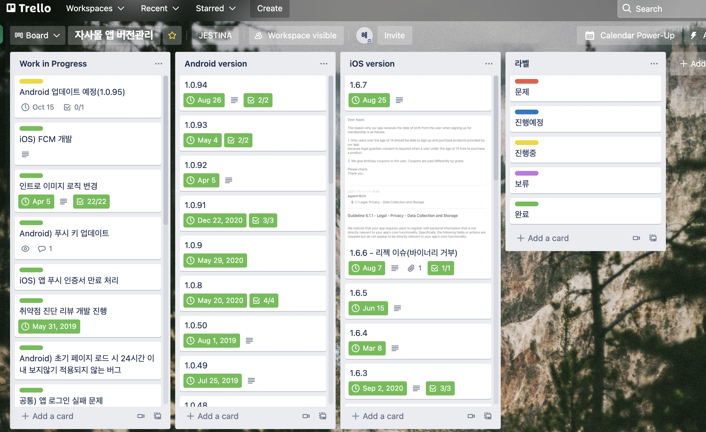 

> Hybrid 앱으로 기출시된 Android, iOS 앱의 유지보수/하자보수 업무를 맡아  배포하고 운영하였습니다.
  
* 연계/소속회사 : Jestina
* 프로젝트 기간: 2019.04~ 2021.06 (2020.08 퇴사 후 외주 진행 중)
* 개발 환경: Xcode, Android Studio
* 개발 언어/라이브러리
    * iOS: Swift, Alamofire, webkit(hybrid), Firebase/Core, Firebase/Message
    * Androd: java, retrofit2, okhttp3, rating, gson, firebase-messaging
* 상세 업무 
     1. 서비스 유지보수/신규개발
        * iOS/Android 정책 모니터링 업데이트 진행 (iOS APNS 지원 대응, Android SDK 업그레이드 대응)
        * ISMS 앱 취약점 분석 및 조치 보고
        * 사용성 개선(상세페이지 확대, Web Cookie 관리, 디바이스 별 테스트, 로딩 속도 개선)
     2. 서비스 하자보수
        * CS 인입 이슈 대응, Web, Moblie Web 이슈 디버깅을 통한 원인 분석
     3. 성과
        * AppleLogin 개발 기획, Google 최소 SDK 변경사항 공유 등 각 플랫폼 이슈 미리 확인 및 대응 진행하여 앱 사용 이슈 없도록 예방
* 링크
    * 홈페이지 : https://m.jestina.co.kr/sp
    * 앱스토어 : https://apps.apple.com/us/app/jestina/id1226908907
    * 플레이스토어 : https://play.google.com/store/apps/details?id=com.romanson.jestina
    
 

**Jestina mERP**

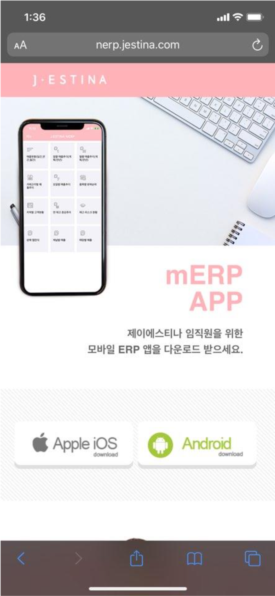 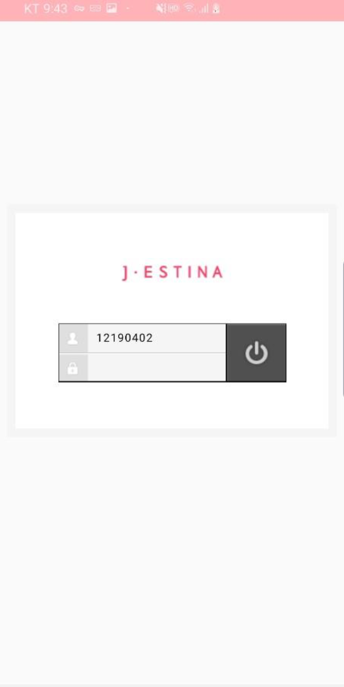 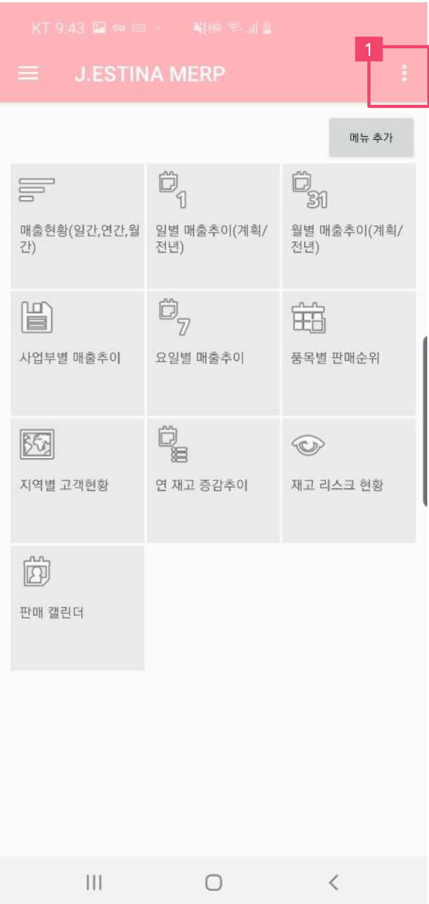 

> 제이에스티나의 ERP 메뉴 중 매출, 재고, 영업 부분을 Native Android/iOS 앱으로 구현한 프로젝트 입니다. 
  
* 연계/소속회사 : Jestina
* 프로젝트 기간: 2019.11~ 2020.04 (6개월)
* 개발 환경 : Xcode
* 개발 언어/라이브러리 : Swift, Alamofire, Charts, SpreadsheetView, JTAppleCalendar, SwiftyJSON
*  상세 업무 
    1. 서비스 개발 
        * 초기 프로젝트 MVC 패턴 적용, Model/View 로직 분리
        * ERP 내부 매출/영업/재고 관련 총 14개 카테고리 페이지 StoryBoard 기반 MainView 생성, 유사 페이지 내부 View AutoLayout으로 개발
        * RestAPI / Alamofire 통신, 데이터 parsing
        * 년/월/일 재고 표현을 위해 SpreadsheetView, Charts, JTAppleCalendar 라이브러리 사용
    2. 성과
        * Enterprise 배포 완료
        * 기존 사무실 PC에서만 접근 가능한 ERP 프로그램을 모바일화.
 

**Jestina 매장직원용 앱**

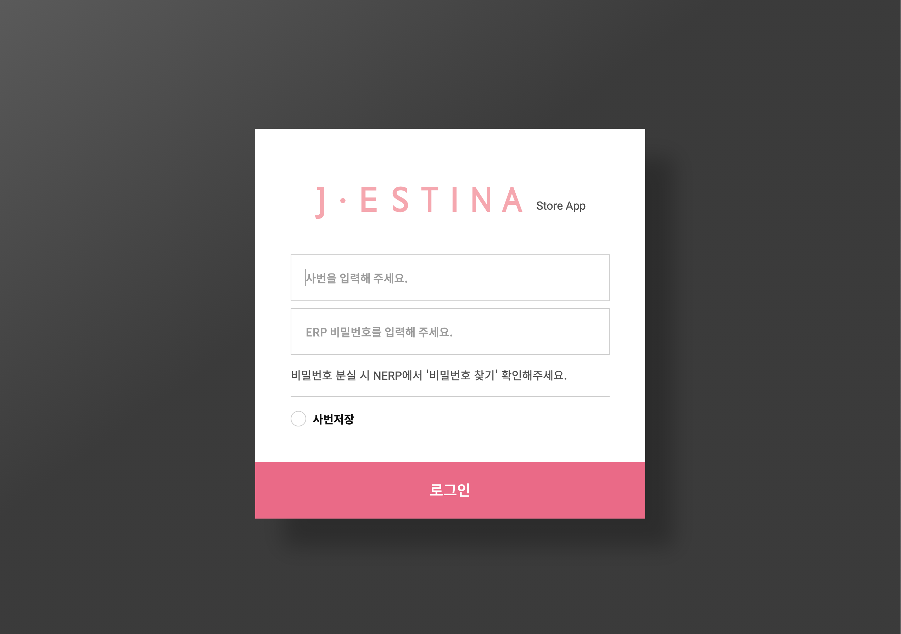 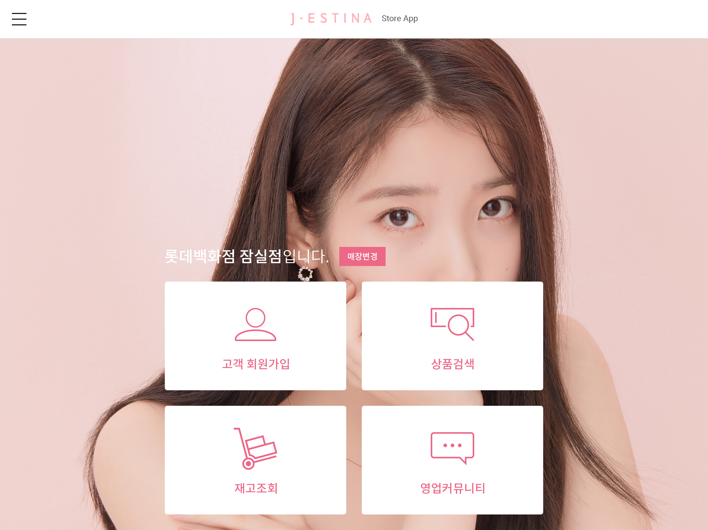 

> 제이에스티나의 백화점 매장에서 고객 회원가입/상품검색/재고조회에 사용할 목적으로 개발된 Hybrid iPad용 앱 프로젝트 입니다.

* 연계/소속회사 : Jestina
* 프로젝트 기간 : 2020.05~ 2020.07 (3개월)
* 개발 환경 : Xcode
* 개발 언어/라이브러리 : Swift, Alamofire, webkit(hybrid)
* 상세 업무 
    1. 서비스 기획/설계/SM
        * 앱 기초 기획 및 설계, 웹페이지 개발사 WBS 관리
    2. 서비스 개발 
        * iOS 초기 프로젝트 MVC 패턴 적용, Mobile Web을 WkWebview로 최적화
        * 제이에스티나 그룹웨어 공지사항 API 연동 / 자사몰 회원가입 연동 / 첨부파일 다운로드 구현
    3. 성과
        * Enterprise 배포 완료
        * 기존 오프라인 고객의 신규 자사몰 가입 수가 증가함. (일 평균 5명)
        * 매장직원이 타 매장 상품 재고상황 및 그룹웨어 공지사항을 확인할 수 있게 함.
  
 

**HeyStars**

 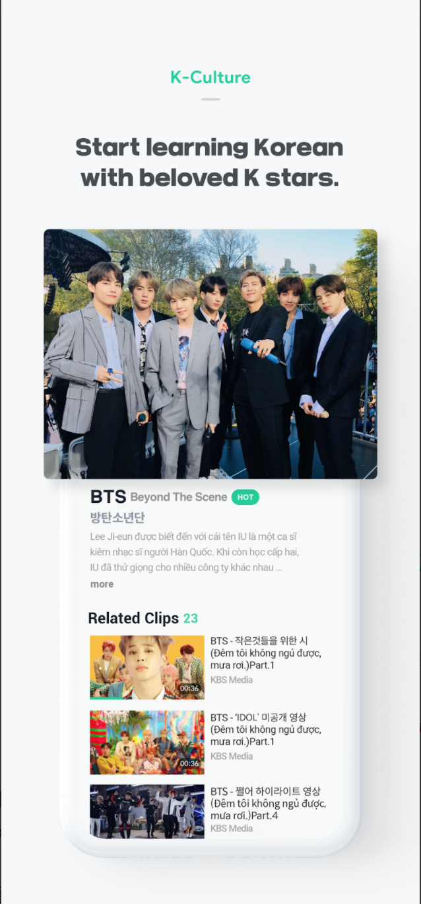   

> 외주로 진행한 Hybrid 앱 프로젝트 입니다. Youtube inline, 음성녹음 기능을 개발하였으며 신규 앱 출시를 성공적으로 마쳤습니다.

* 연계/소속회사 : HeyStars(외주)
* 프로젝트 기간 : 약 3주
* 개발 환경 : Xcode
* 개발 언어/라이브러리 : Swift, Alamofire, AudioKit, SnapKit, Firebase/Messaging
* 상세 업무 
    1. 서비스 개발 
        * 초기 개발환경 세팅, Youtube 영상 inline, 자동재생 개발, FCM 설정, 음성녹음/재생/전송 기능 개발
    2. 성과
        * 신규 앱 앱스토어 심사 리젝 대응 및 출시 완료.
* 링크
    * 앱스토어 : https://apps.apple.com/vn/app/heystars-%ED%97%A4%EC%9D%B4%EC%8A%A4%ED%83%80%EC%A6%88/id1493475120#?platform=iphone
    
 

**피클플레이**

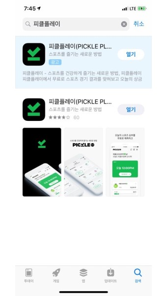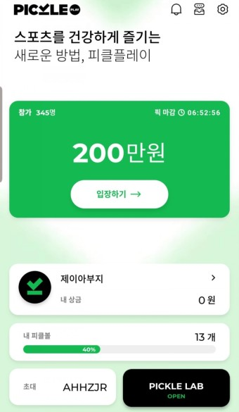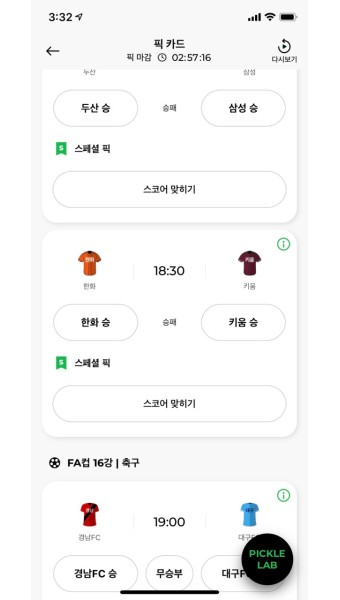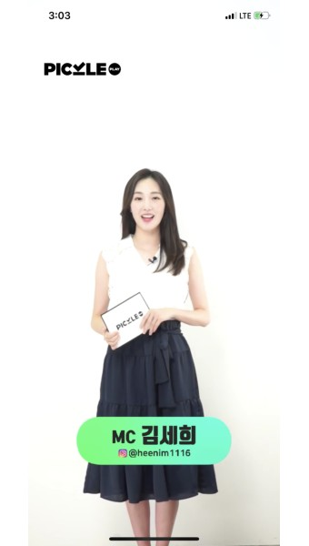

> 스포츠 경기의 승/패를 예상하는 앱으로, 잼라이브와 유사하지만 좀 더 기능이 많은 앱입니다. Android기준 다운로드가 20만을 넘었습니다. 초기 기획 단계부터 참여하여 빌드업을 해 나갔습니다. 비디오 스트리밍/스트리밍 화면이 시간이 지날 때 까지 종료되지 않도록 하는 기능, 인앱결제를 구현하고 랭킹을 보여주며 Select Box를 경우에 따라 다르게 보여주는 등 UI적으로 굉장히 공을 들였습니다. 크기가 큰 앱 개발을 초기 단계부터 시작할 때 클래스 하나를 생성할 때도 추후 사용성을 고려하고 나무보다 숲을 봐야하는 것을 배웠던 앱입니다. 1차 개발을 완료하고 AppStore출시까지 완료하였습니다. 

* 회사 : 외주
* 개발 기술 : Swift4
* 담당 업무
  * 앱 초기 설계, 회원가입/로그인,  in-app 결제 연동, 결제, 비디오 스트리밍 등 초기 앱 설계 및 1차 개발 완료, 앱스토어 등재
* 플레이스토어 : https://play.google.com/store/apps/details?id=com.wagti.pickle&hl=ko

 

**MINT**

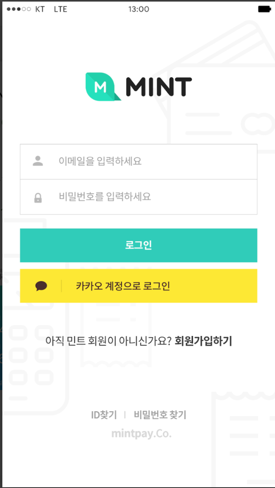  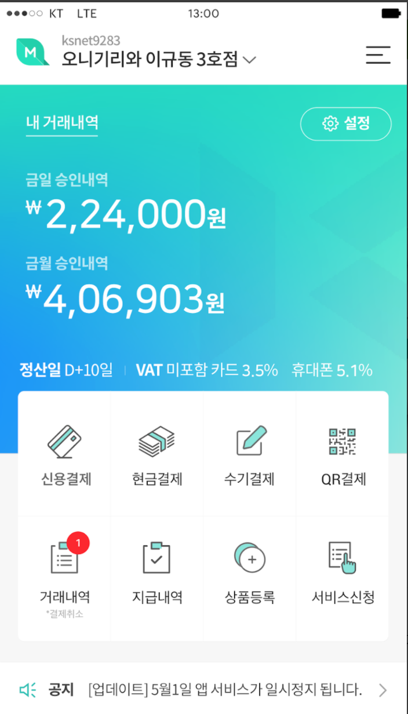

> 처음 작업해본 금융 앱입니다. Android 프로젝트로, UI를 제외한 개발에 참여했습니다. 블루투스 카드리더기 연동을 진행한 후 Socket통신을 통해 카드정보를 받아와 실제로 결제가 되도록 구현했습니다. PDA와 유사하지만, 앱을 설치하고 KSNET의 블루투스 카드 리더기만 있으면 어디서든 결제가 가능한 것이 핵심이였습니다. 전표를 생성하는 것, 결제전표를 생성한 뒤 리턴되는 승인전표 값을 분석하고 블루투스 통신을 하는 부분이 어려웠지만, 무사히 개발을 마쳤습니다. 앱을 출시하기 위해서 여신금융협회 TTA 인증심사를 진행했고 모든 항목에서 안정성을 인정받아 정상적으로 카드결제가 가능한 앱으로 출시되었습니다. 

* 회사 : 외주
* 개발 기술 : Java
* 담당 업무
  * 리더기 연동 후 Socket 통신을 통해 카드 정보 읽어와 Van사 결제 전표 생성
  * MS/IC결제 완료 처리
  * App 무결성/루팅방지/암호화 패스워드 개발
  * 전표 라이브러리 생성
* 홈페이지 : https://mint.ksnet.co.kr/mint/index.jsp
* 플레이스토어 : https://play.google.com/store/apps/details?id=com.codecrain.ksnet

 

**온라인 슈퍼마켓 바르게온다**

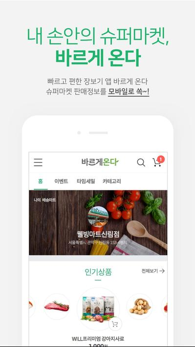  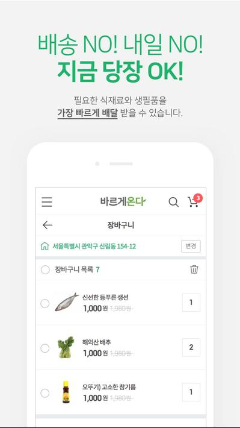 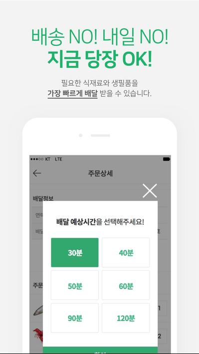 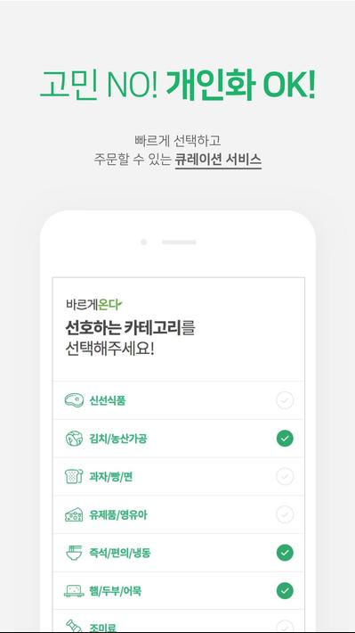

> react-native 앱입니다. 온라인 슈퍼마켓으로 현재의 배달의민족 B마트와 유사합니다. 사용자가 결제를 완료하면 배달기사에게 알람이 가고, 점주에게도 알람이 가도록 푸시서버 설계를 진행했습니다. Android/iOS 동시 출시까지 완료하였으며  배달기사용 앱까지 함께 제작하였습니다. 현재 Google Playstore에서는 내려갔네요.
* 회사 : 외주
* 개발 기술 : react-native, java, objective-c, redux
* 담당 업무
  * 고객용 앱 / 배달원용 앱 2가지 앱을 개발, 실시간 앱 내부 Notification 대응
  * 선택 상품 결제 기능, 장바구니 기능, 결제 완료 처리 및 배달 상태 제공
* facebook : https://www.facebook.com/pg/%EB%B0%94%EB%A5%B4%EA%B2%8C-%EC%98%A8%EB%8B%A4-2040387219525892/posts/

 

**지비다**

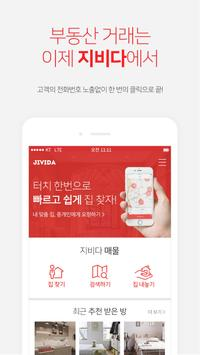 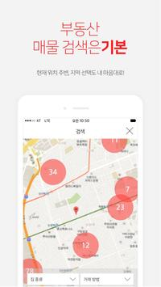 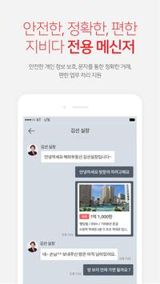 

> react-native 앱입니다. 이 앱은 로그인 사용자가 중개사인지/고객인지 분리하여   하나의 앱으로 동시에 두가지 타입의 사용자를 설정할 수 있도록 진행했습니다. 중개사와 Socket 통신을 통해 실시간 채팅이 가능하게 구현했습니다. 

* 회사 : 외주
* 개발 기술 : react-native, java, objective-c, redux
* 담당 업무
  * Socket 통신 기술 사용하여 메신저 기능 유치 (채팅)
  * 하나의 앱을 두 가지 사용자(고객, 중개사)로 나눠 뷰를 제공하는 형태로 개발
  * 부동산 관련 정보를 한 번에 입력할 수 있도록 뷰를 설정
* 뉴스기사 : https://bizn.donga.com/realestate/3/all/20180704/90900695/2

 

**시와 시 사이 - 시간**

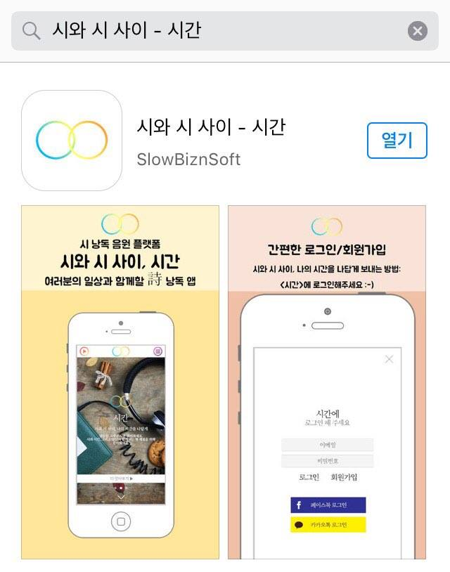 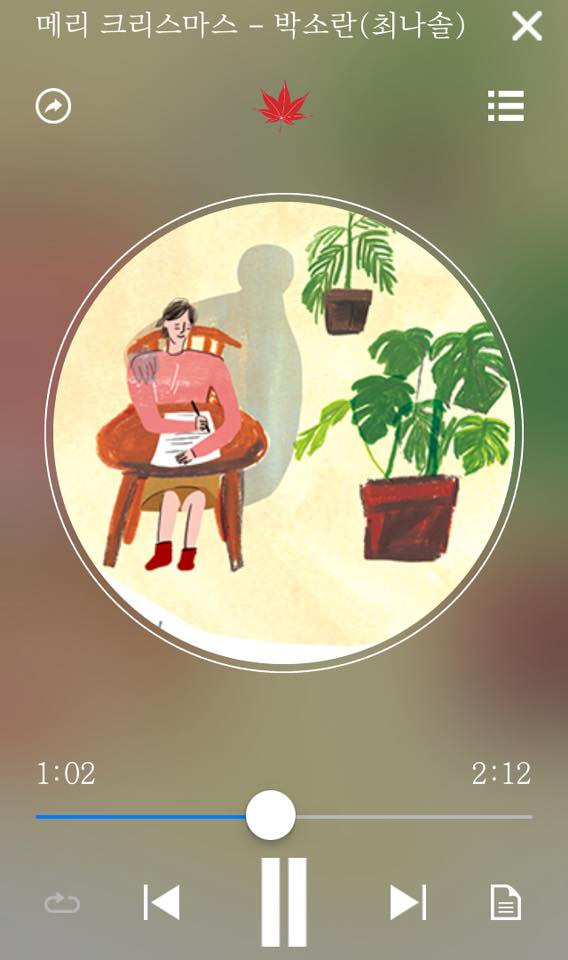 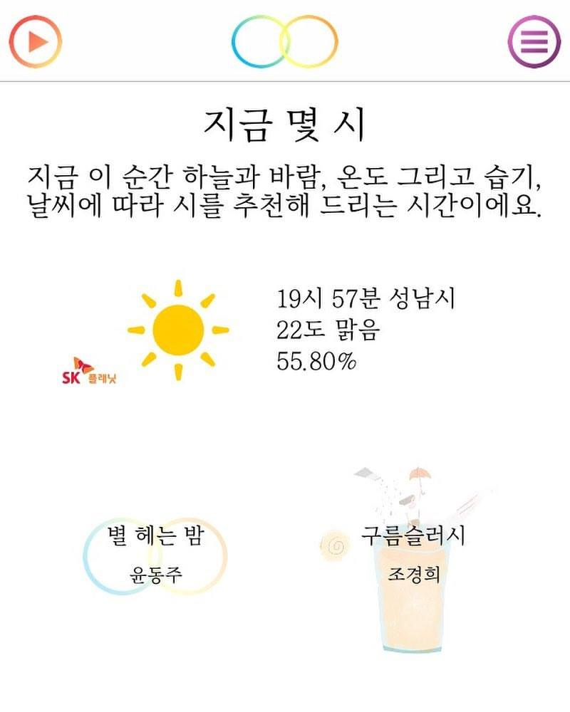 

> Objective-c 프로젝트로 첫 외주로 음악을 재생하고 백그라운드 재생을 하고, 위치 및 습도를 받아와 표기하는 시 낭독 앱입니다. 스트리밍 서버 비용의 부담으로 인하여 현재는 앱서비스를 쉬어가는 상태입니다.

* 회사 : 외주
* 개발 기술 : Objective-c
* 담당 업무
  * 클라이언트와 소통하여 앱의 기획 분석, 설계, 개발 진행
  * 음악 스트리밍, 페이스북 연동, 플레이리스트 관리, 현재 위치와 습도를 기준으로 시 추천
  * 앱 스토어 초기 등재 및 리젝 대응, 출시
* 페이스북 : https://www.facebook.com/timeforpoetry/photos/a.241268809638988/707802439652287/?type=3&theater

 

**레코드팜**

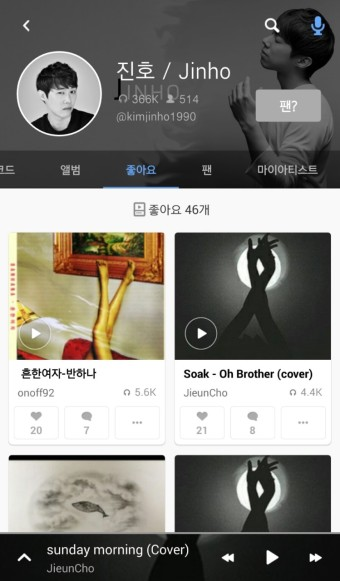 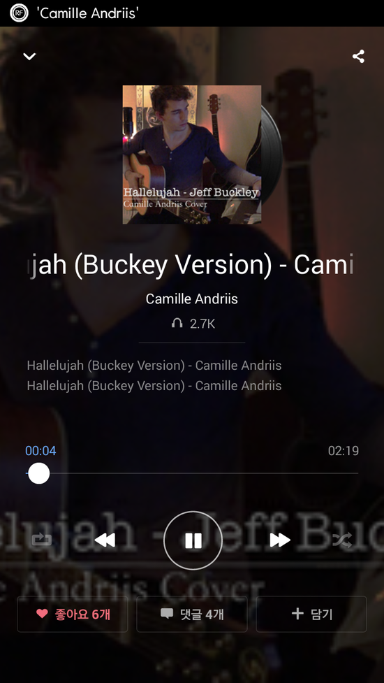 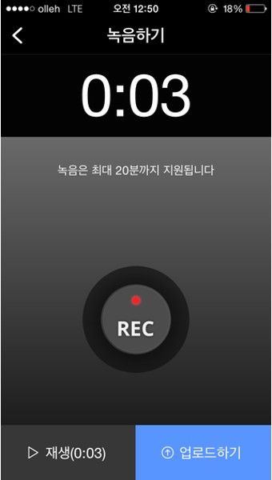   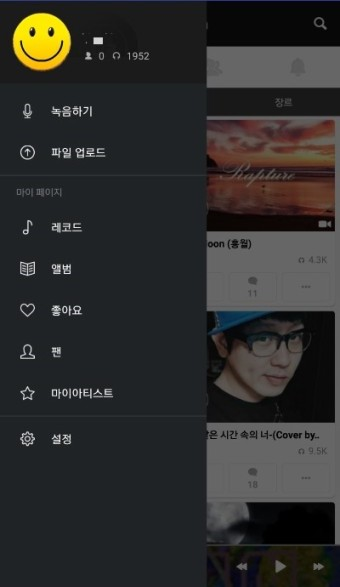 

> 첫번째 Objective-c 프로젝트로 초기 프로젝트는 외주를 통해 진행되었고 입사 후 메인페이지 개편을 진행하며 프로젝트의 전반적인 상태를 확인하였습니다. 초반 선임개발자에게 인수인계를 2달 간 받았습니다. iOS 앱의 특징 iOS 프로젝트의 생태계, Objective-c에 대해 공부하는 시간을 많이 가졌습니다. 100만 MAU를 유지하던 플랫폼인 만큼 작은 버그도 없도록 혼자서라도 코드리뷰를 진행했고, 사내에선 Trello를 통한 애자일-스프린트를 통해 개발 내용을 공유하였습니다. 현재는 인수합병이 되어 기억속으로 사라진 플랫폼입니다.

* 회사 : Recordfarm
* 개발 기술 : Objective-c / Trello / GitHub
* 담당 업무
  * Objective-c 기개발 프로젝트 하자보수, 유지보수, 업데이트 진행
  * Music Player, Widget, Facebook Login 연동, 결제모듈 연동, FCM 연동
  * 녹음파일 생성 및 파일 시스템 관리, 음악 파일 다운로드
  * UI/UX 수정, 코드 리팩토링 진행
  * 간헐적으로 Android 버그 수정 및 UI/UX 업데이트
* 나무위키 : https://ko.wikipedia.org/wiki/%EB%A0%88%EC%BD%94%EB%93%9C%ED%8C%9C

 

