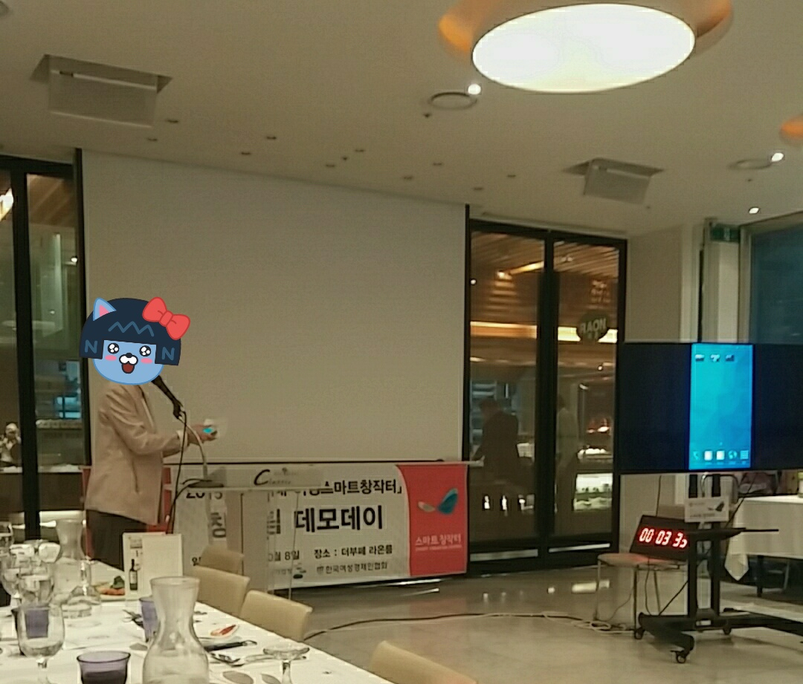
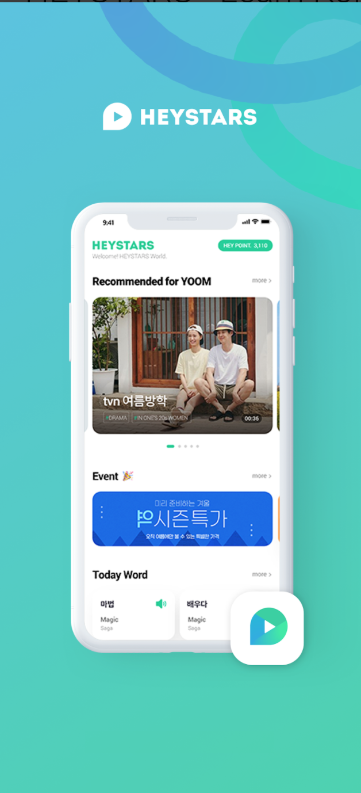
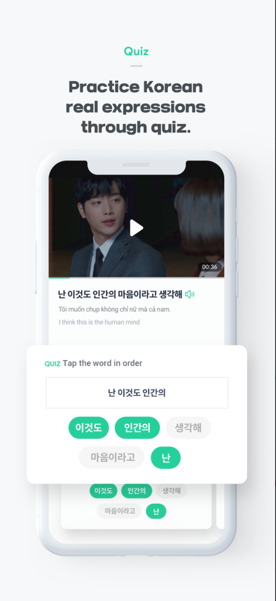
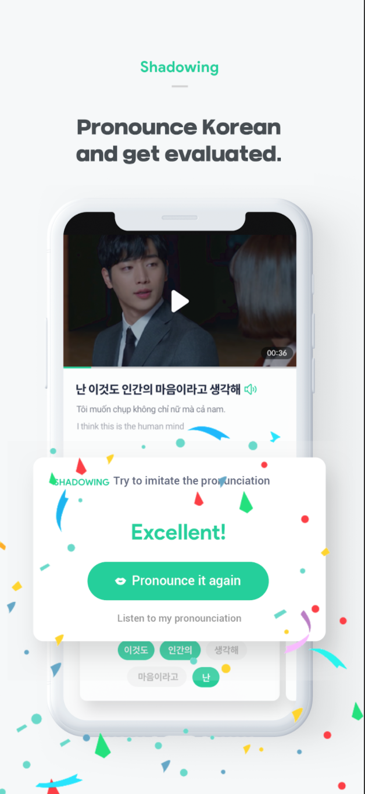

## 소개

 

정다혜(Dahye Jeong)
=========================

경력 5년차, Android, iOS, react-native 기술을 경험하였고 **iOS 앱 개발**을 하고 있습니다. 
계획을 세우는 것을 좋아하고, 절차에 맞게 이행하여 체크리스트에 완료 체크를 하는 것이 가장 즐겁습니다. 
**논리적인 코드**를 작성하고, 컨퍼런스에서 세션을 진행하며 **최신 개발 트렌드**를 읽어가며 
**iOS 앱 개발**에서 **문제 해결 능력이 뛰어난** **경험 많은 개발자**가 되는 것이 목표입니다. 

* Email: [90dhjeong@gmail.com](mailto://90dhjeong@gmail.com)
* Github: [github.com/90dhjeong](https://github.com/90dhjeong)

 

## 목차
* [학력](#학력)
* [경력](#경력)
* [기술](#기술)
* [활동](#활동)
* [프로젝트](#프로젝트)

 

## 학력
*  동덕여자대학교 컴퓨터학과 (2012 ~ 2016)

 

## 경력

[**JESTINA**](https://www.jestina.co.kr/)
> 제이에스티나의 IT팀에서 모바일 앱 개발/관리를 담당하였습니다.
> 퇴사 후 모바일 앱 관련 자문 및 유지보수 외주를 진행중입니다.

* 기간: 2019.04 ~ 2020.08    
* 직급: 대리
* 기술: Android, Swift, Bitbucket

[**Recordfarm**](https://ko.wikipedia.org/wiki/%EB%A0%88%EC%BD%94%EB%93%9C%ED%8C%9C)
> 사운드클라운드와 유사한 형태의 국내 인디 음악 플랫폼 Recordfarm에서 iOS 개발을 담당하였습니다.
> 이후 업종전환으로 SI/SM을 담당하였습니다.

* 기간: 2016.8 ~ 2018.10
* 직급: Software Engineer
* 기술: Objective-c, Swift, Github, Trello, SourceTree, Slack, React-native

[**nemodigm**](http://www.nemodigm.com/home/index.php?pid=kr)
> 개인의 취향을 기반으로 Youtube 음악을 재생해주는 Android 앱 개발을 담당하였습니다.

* 기간: 2015.02 ~ 2016.02
* 직급: Assistant
* 기술: Android

 

## 기술

### Mobile
- Swift
- Android java
- MVC, MVP, MVVM Pattern

### Process
- 커뮤니케이션 - Slack
- 이슈관리 - Trello
- 버전관리 - Git(Bitbucket/SourceTree)

 

## 활동

[**덕성여자대학교 스마트창작터(중소기업청 정부지원사업)**](https://m.blog.naver.com/PostView.nhn?blogId=dswuniv_blog&logNo=220802103586&proxyReferer=https:%2F%2Fwww.google.com%2F)
> 중소기업청주관 정부지원사업 덕성여자대학교 스마트창작터에서 창업지원팀으로 선발되어 창업팀의 개발팀장을 역임하였습니다.
> 마이포켓클로젯이라는 옷장관리 어플리케이션을 기반으로 창업을 진행하였습니다. 

* 기간 : 2015.04~2015.11

  

 

## 프로젝트

**1. Jestina**

    

> Hybrid 앱으로 기출시된 Android, iOS 앱의 유지보수/하자보수 업무를 맡아  배포하고 운영하였습니다.
  
* 연계/소속회사 : Jestina
* 프로젝트 기간: 2019.04~ 2021.06 (2020.08 퇴사 후 외주 진행 중)
* 개발 환경: Xcode, Android Studio
* 개발 언어/라이브러리
    * iOS: Swift, Alamofire, webkit(hybrid), Firebase/Core, Firebase/Message
    * Androd: java, retrofit2, okhttp3, rating, gson, firebase-messaging
* 상세 업무 
     1. 서비스 유지보수/신규개발
        * iOS/Android 정책 모니터링 업데이트 진행 (iOS APNS 지원 대응, Android SDK 업그레이드 대응)
        * ISMS 앱 취약점 분석 및 조치 보고
        * 사용성 개선(상세페이지 확대, Web Cookie 관리, 디바이스 별 테스트, 로딩 속도 개선)
     2. 서비스 하자보수
        * CS 인입 이슈 대응, Web, Moblie Web 이슈 디버깅을 통한 원인 분석
     3. 성과
        * AppleLogin 개발 기획, Google 최소 SDK 변경사항 공유 등 각 플랫폼 이슈 미리 확인 및 대응 진행하여 앱 사용 이슈 없도록 예방
* 링크
    * 홈페이지 : https://m.jestina.co.kr/sp
    * 앱스토어 : https://apps.apple.com/us/app/jestina/id1226908907
    * 플레이스토어 : https://play.google.com/store/apps/details?id=com.romanson.jestina
    
 

**2. Jestina mERP**

   

> 제이에스티나의 ERP 메뉴 중 매출, 재고, 영업 부분을 Native Android/iOS 앱으로 구현한 프로젝트 입니다. 
  
* 연계/소속회사 : Jestina
* 프로젝트 기간: 2019.11~ 2020.04 (6개월)
* 개발 환경 : Xcode
* 개발 언어/라이브러리 : Swift, Alamofire, Charts, SpreadsheetView, JTAppleCalendar, SwiftyJSON
*  상세 업무 
    1. 서비스 개발 
        * 초기 프로젝트 MVC 패턴 적용, Model/View 로직 분리
        * ERP 내부 매출/영업/재고 관련 총 14개 카테고리 페이지 StoryBoard 기반 MainView 생성, 유사 페이지 내부 View AutoLayout으로 개발
        * RestAPI / Alamofire 통신, 데이터 parsing
        * 년/월/일 재고 표현을 위해 SpreadsheetView, Charts, JTAppleCalendar 라이브러리 사용
    2. 성과
        * Enterprise 배포 완료
        * 기존 사무실 PC에서만 접근 가능한 ERP 프로그램을 모바일화.
 

**3. Jestina 매장직원용 앱**

  

> 제이에스티나의 백화점 매장에서 고객 회원가입/상품검색/재고조회에 사용할 목적으로 개발된 Hybrid iPad용 앱 프로젝트 입니다.

* 연계/소속회사 : Jestina
* 프로젝트 기간 : 2020.05~ 2020.07 (3개월)
* 개발 환경 : Xcode
* 개발 언어/라이브러리 : Swift, Alamofire, webkit(hybrid)
* 상세 업무 
    1. 서비스 기획/설계/SM
        * 앱 기초 기획 및 설계, 웹페이지 개발사 WBS 관리
    2. 서비스 개발 
        * iOS 초기 프로젝트 MVC 패턴 적용, Mobile Web을 WkWebview로 최적화
        * 제이에스티나 그룹웨어 공지사항 API 연동 / 자사몰 회원가입 연동 / 첨부파일 다운로드 구현
    3. 성과
        * Enterprise 배포 완료
        * 기존 오프라인 고객의 신규 자사몰 가입 수가 증가함. (일 평균 5명)
        * 매장직원이 타 매장 상품 재고상황 및 그룹웨어 공지사항을 확인할 수 있게 함.
  
 

**4. HeyStars**

    

>  K-POP 영상을 통해 한국어 공부를 할 수 있는 iOS Hybrid 앱 프로젝트 입니다. Youtube inline, 음성녹음 기능을 개발하였으며 신규 앱 출시를 성공적으로 마쳤습니다.

* 연계/소속회사 : HeyStars/외주
* 프로젝트 기간 : 약 3주
* 개발 환경 : Xcode
* 개발 언어/라이브러리 : Swift, Alamofire, AudioKit, SnapKit, Firebase/Messaging
* 상세 업무 
    1. 서비스 개발 
        * 초기 개발환경 세팅, Youtube 영상 inline, 자동재생 개발, FCM 설정, 음성녹음/재생/전송 기능 개발
    2. 성과
        * 신규 앱 앱스토어 심사 리젝 대응 및 출시 완료.
* 링크
    * 앱스토어 : https://apps.apple.com/vn/app/heystars-%ED%97%A4%EC%9D%B4%EC%8A%A4%ED%83%80%EC%A6%88/id1493475120#?platform=iphone
    
 

**5. 피클플레이**

> 당일 진행되는 스포츠게임의 목록을 비디오로 보여준 뒤 결과를 예상하고, 정답을 맞춘 모든 사용자에게 상금을 나눠주는 iOS Native 앱 프로젝트 입니다.

* 연계/소속회사 : Wagti/외주
* 프로젝트 기간: 2018.10~2019.01 (4개월)
* 개발 환경: Xcode
* 개발 언어/라이브러리: iOS: Swift, Alamofire, SwiftyStoreKit, SwiftyJSON, SwiftDate, Firebase/Messaging, Kingfisher, IAPHelper 등
* 상세 업무 
    1. 서비스 개발 
        * 전체 UI 개발, 총 VC 40개, Modal 30개 이상의 View 4개의 Storyboard+xib 파일로 관리
        * 회원가입 인증로직, 비디오 스트리밍 재생, 유동 Tableview 구현, 승리 구현, View내부 타이머 구현하여 동적으로 View 변화, 비동기 태스크 처리
        * Apple in-app 결제, firebase Notification 구현
   2. 성과
        * 앱스토어 계정 생성 및 앱스토어 출시 완료, 10만 다운로드 달성
* 링크
    * 플레이스토어 : https://play.google.com/store/apps/details?id=com.wagti.pickle&hl=ko

 

**6. MINT**

  

> 블루투스 리더기를 통한 소켓통신 기반 Android 앱 개발 프로젝트입니다. 내부 카드결제 기능 개발 및 여신금융협회 심사 진행,  스토어 출시까지 완료하였습니다.

* 연계/소속회사 : KSNET/외주
* 프로젝트 기간: 2018.05~2018.09 (5개월)
* 개발 환경: Android Studio
* 개발 언어/라이브러리:  java
* 상세 업무 
    1. 서비스 개발 
        * UI/UX 개발이 완료 된 프로젝트에 개발 진행
        * KSNET 카드 리더기를 통한 앱 내부 블루투스 통신 기능 개발
        * 소켓통신을 통한 카드 정보 추출, 전표 생성하여 카드결제 구현(MS/IS)  라이브러리 생성
        * 앱 무결성/루팅방지/비밀번호 암호화/카드정보 암호화 진행
    2. 성과
        * 여신금융협회 TTA 심사 시연 진행, 성공적으로 여신금융협회 승인 완료
        * Google PlayStore 출시 완료
* 링크
    * 홈페이지 : https://mint.ksnet.co.kr/mint/index.jsp
    * 플레이스토어 : https://play.google.com/store/apps/details?id=com.codecrain.ksnet

 

**7. 온라인 슈퍼마켓 바르게온다**

    

> 온라인 슈퍼마켓으로 장바구니에 상품을 담고 결제를 진행하면 배달기사용 앱에 알람이 전송되는 react-native 프로젝트 입니다. Android/iOS 출시를 완료하였습니다.

* 연계/소속회사 : Recordfarm/외주
* 프로젝트 기간: 2018.05~2018.09 (5개월)
* 개발 환경: Android Studio
* 개발 언어/라이브러리:  java

* 회사 : 외주
* 개발 기술 : react-native, java, objective-c, redux
* 담당 업무
  * 고객용 앱 / 배달원용 앱 2가지 앱을 개발, 실시간 앱 내부 Notification 대응
  * 선택 상품 결제 기능, 장바구니 기능, 결제 완료 처리 및 배달 상태 제공
* facebook : https://www.facebook.com/pg/%EB%B0%94%EB%A5%B4%EA%B2%8C-%EC%98%A8%EB%8B%A4-2040387219525892/posts/

 

**8. 지비다**

   

> react-native 앱입니다. 이 앱은 로그인 사용자가 중개사인지/고객인지 분리하여   하나의 앱으로 동시에 두가지 타입의 사용자를 설정할 수 있도록 진행했습니다. 중개사와 Socket 통신을 통해 실시간 채팅이 가능하게 구현했습니다. 

* 회사 : 외주
* 개발 기술 : react-native, java, objective-c, redux
* 담당 업무
  * Socket 통신 기술 사용하여 메신저 기능 유치 (채팅)
  * 하나의 앱을 두 가지 사용자(고객, 중개사)로 나눠 뷰를 제공하는 형태로 개발
  * 부동산 관련 정보를 한 번에 입력할 수 있도록 뷰를 설정
* 뉴스기사 : https://bizn.donga.com/realestate/3/all/20180704/90900695/2

 

**9. 시와 시 사이 - 시간**

   

>  공공데이터 날씨정보를 받아와 날씨 기반 시 음원을 재생하는  iOS Native 앱 프로젝트입니다.

* 연계/소속회사 : 외주/Recordfarm
* 프로젝트 기간: 2017.06  (1개월)
* 개발 환경: Xcode
* 개발 언어/라이브러리:  Objective-c, AFNetworking, StreamingKit, FBSDKLoginKit, SBJson
* 상세 업무 
    1. 서비스 개발 
        * 위치기반 날씨 공공데이터 API 사용
        * 음악 Player 기능 구현, PlayList 관리 기능 구현
        * FaceBook 로그인 연동, kakao 로그인 연동
   2. 성과
        * App Store 출시 완료
* 페이스북 : https://www.facebook.com/timeforpoetry/photos/a.241268809638988/707802439652287/?type=3&theater

 

**10. 레코드팜**

      

> 100만 MAU를 유지하던 플랫폼의 iOS 앱 개발 담당자로 대형 음악 플랫폼/커뮤니티 iOS 개발을 담당하였습니다.

* 연계/소속회사 : Recordfarm
* 프로젝트 기간: 2016.08~2017.05 (10개월)
* 개발 환경: Xcode
* 개발 언어/라이브러리:  Objective-c, AFNetworking, StreamingKit, FBSDKLoginKit, Google/Analytics, Google/CloudMessaging 등
* 상세 업무 
   1. 서비스 유지보수/하자보수/신규개발
        * UI/UX 개선, 커뮤니티 페이지 신규 개발, 음악 Player 기능 고도화, 인입 CS 대응 진행
        * 레거시 코드 제거 및 리팩토링 진행, 결제모듈 연동(이니시스)
    2. 성과
        * App Store 정책 대응 및 업데이트 지속 진행
        * 지속적인 앱 다운로드 증가
* 나무위키 : https://ko.wikipedia.org/wiki/%EB%A0%88%EC%BD%94%EB%93%9C%ED%8C%9C

 

